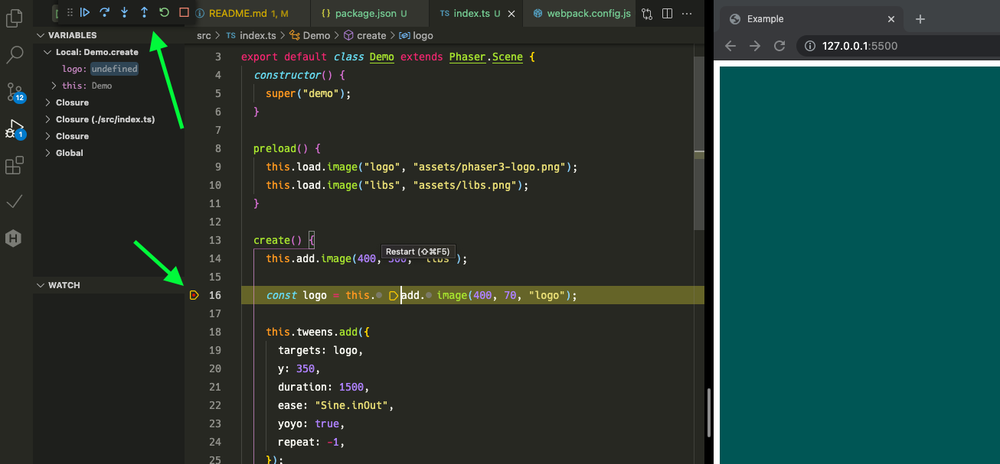

# phaser3_vscode_debuggable_template

The template project which can debug at VSCode.

## Usage

Initialize.

```shell
npm install
```

Start watching

- transpile `.ts` file
- copy files

```shell
npm run watch
```

start devServer in another shell window,

```shell
npm run start
```

Start debug (Press `F5` ).

You set break-points at any place in your codes!!

;
